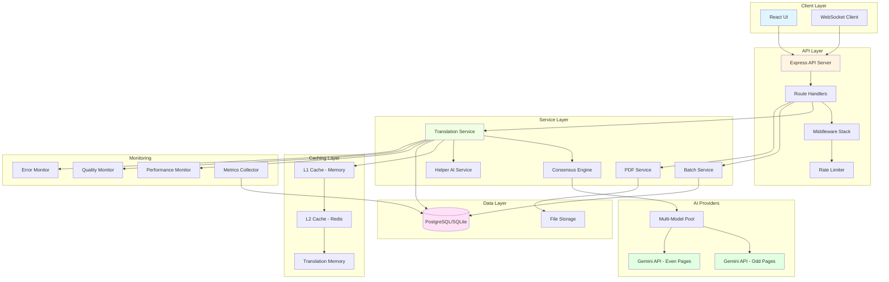
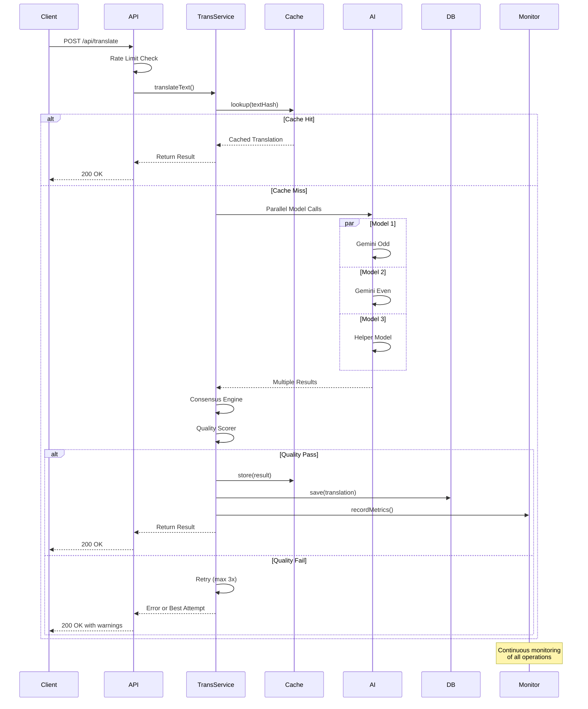
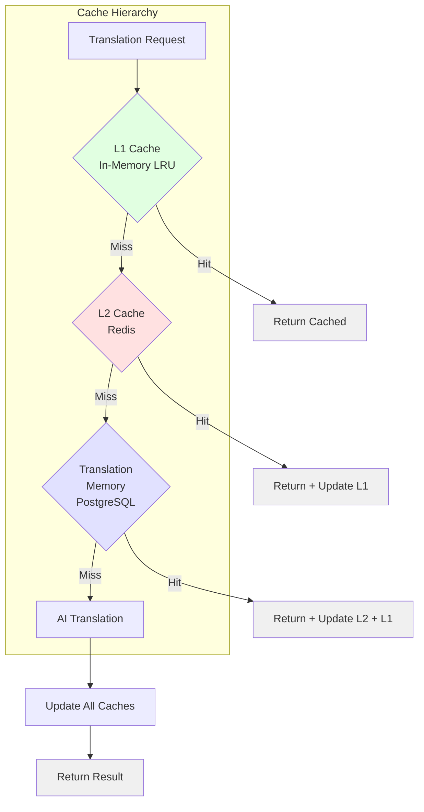
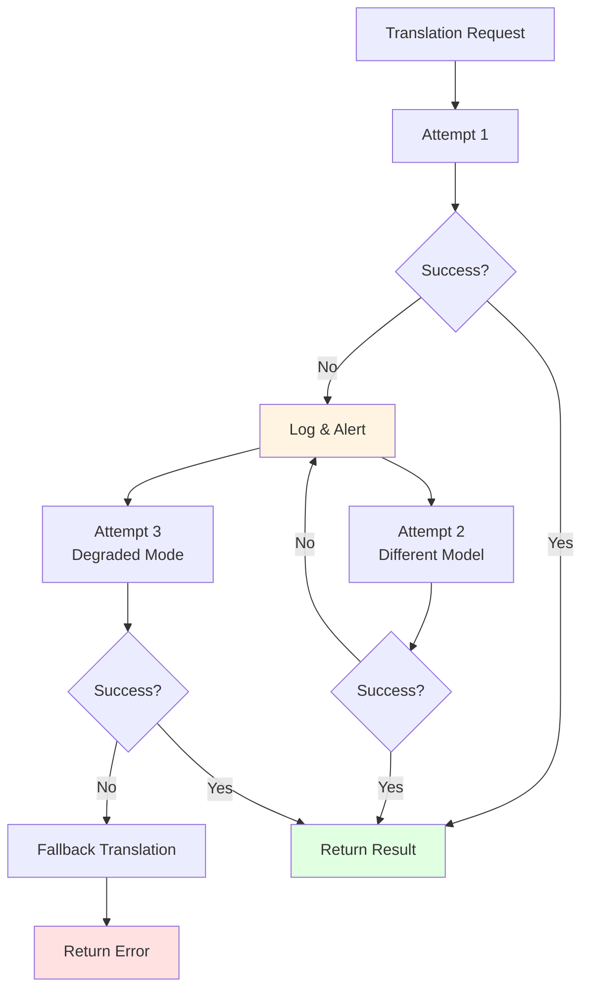
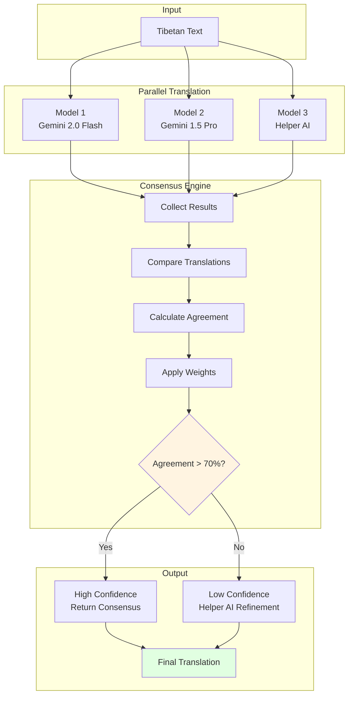
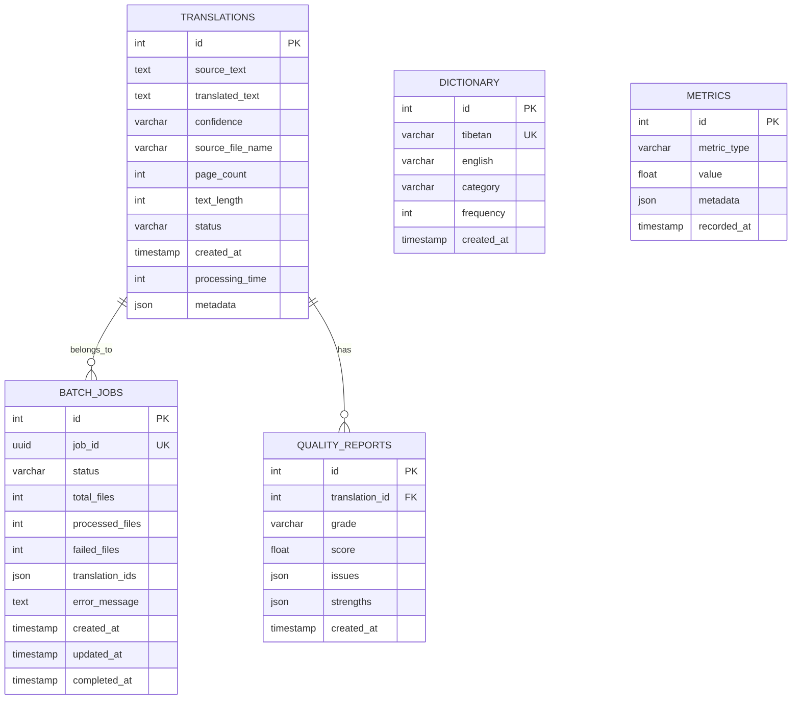
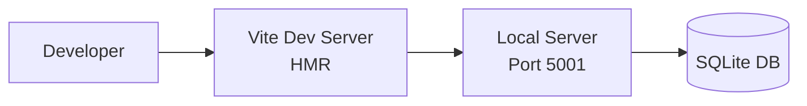
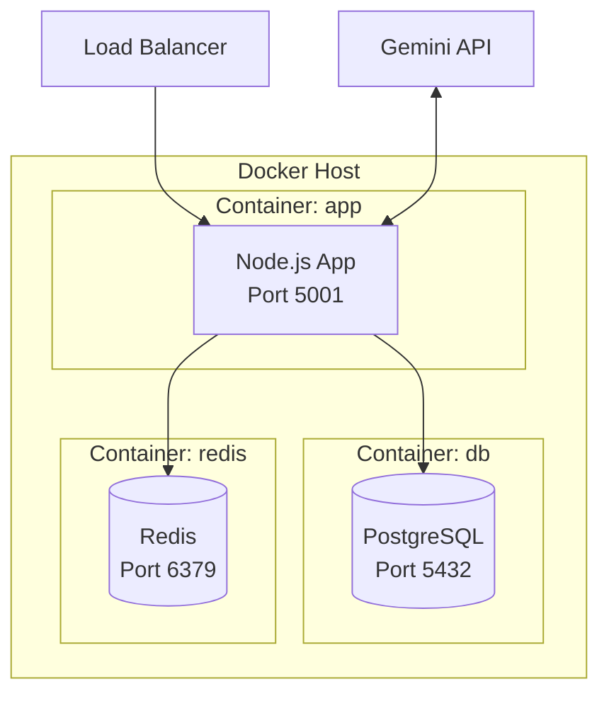
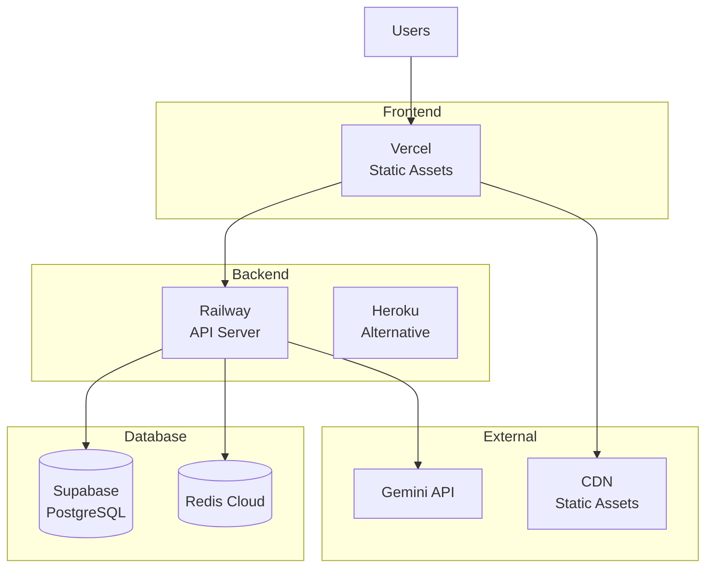

# Tibetan Translation Tool - System Architecture

## Table of Contents

1. [Overview](#overview)
2. [System Architecture](#system-architecture)
3. [Translation Pipeline](#translation-pipeline)
4. [Data Flow](#data-flow)
5. [Caching Strategy](#caching-strategy)
6. [Error Recovery Flow](#error-recovery-flow)
7. [Multi-Model Consensus](#multi-model-consensus)
8. [Component Details](#component-details)
9. [Database Schema](#database-schema)
10. [Deployment Architecture](#deployment-architecture)

---

## Overview

The Tibetan Translation Tool is a production-grade, full-stack application designed for high-quality Tibetan-to-English translation. It leverages Google Gemini 2.0 Flash with advanced features including multi-model consensus, quality validation, and comprehensive monitoring.

### Key Features

- **Multi-Model Translation**: Consensus-based translation using multiple AI models
- **Quality Assurance**: Automated quality scoring and validation gates
- **Batch Processing**: Parallel processing with checkpointing and partial success handling
- **Real-time Streaming**: SSE-based progress updates
- **Multi-Layer Caching**: L1 (memory), L2 (Redis), and Translation Memory
- **Comprehensive Monitoring**: Performance, quality, and error tracking

### Technology Stack

**Frontend:**
- React 18 + TypeScript
- Vite (build tool)
- Wouter (routing)
- TanStack Query (state management)
- shadcn/ui (component library)

**Backend:**
- Express.js + TypeScript
- Drizzle ORM
- PostgreSQL / SQLite (dual database support)
- Redis (optional caching)

**AI Services:**
- Google Gemini 2.0 Flash (primary)
- Dual API key strategy (odd/even pages)
- Multi-model consensus engine

**Infrastructure:**
- Node.js 18+
- Tesseract.js (OCR)
- Docker (containerization)

---

## System Architecture



---

## Translation Pipeline

```mermaid
flowchart LR
    subgraph "Input Processing"
        Input[PDF/Text Input]
        Extract[Text Extractor]
        OCRCheck{Need OCR?}
        Tesseract[Tesseract OCR]
    end

    subgraph "Text Processing"
        Validate[Unicode Validator]
        Chunk[Text Chunker]
        Preprocess[Preprocessor]
    end

    subgraph "Translation Engine"
        Cache{Check Cache}
        CacheHit[Return Cached]
        MultiModel[Multi-Model Translation]
        Consensus[Consensus Engine]
        Helper[Helper AI Refinement]
    end

    subgraph "Quality Control"
        QScore[Quality Scorer]
        QGate{Quality Gate}
        Retry[Retry Translation]
        Final[Finalize]
    end

    subgraph "Output"
        Format[Format Output]
        Store[Store in DB]
        PDF[Generate PDF]
        Return[Return Result]
    end

    Input --> Extract
    Extract --> OCRCheck
    OCRCheck -->|Yes| Tesseract
    OCRCheck -->|No| Validate
    Tesseract --> Validate
    Validate --> Chunk
    Chunk --> Preprocess

    Preprocess --> Cache
    Cache -->|Hit| CacheHit
    Cache -->|Miss| MultiModel
    MultiModel --> Consensus
    Consensus --> Helper

    Helper --> QScore
    QScore --> QGate
    QGate -->|Fail| Retry
    QGate -->|Pass| Final
    Retry --> MultiModel

    Final --> Format
    Format --> Store
    Store --> PDF
    PDF --> Return
    CacheHit --> Return

    style Input fill:#e1f5ff
    style Cache fill:#ffe1f5
    style QGate fill:#fff4e1
    style Return fill:#e1ffe1
```



### Pipeline Stages

1. **Input Processing** (0-5s)
   - PDF text extraction or OCR
   - Unicode validation
   - Text normalization

2. **Text Processing** (1-2s)
   - Chunking by pages/sections
   - Tibetan syllable detection
   - Context window assembly

3. **Translation Engine** (5-30s)
   - Cache lookup (L1 → L2 → Translation Memory)
   - Multi-model translation (if cache miss)
   - Consensus calculation
   - Helper AI refinement

4. **Quality Control** (2-5s)
   - Automated quality scoring
   - Format compliance check
   - Term consistency validation
   - Quality gate evaluation

5. **Output** (1-3s)
   - Result formatting
   - Database persistence
   - PDF generation (optional)

---

## Data Flow



---

## Caching Strategy



### Cache Layers

#### L1 Cache (In-Memory)
- **Type**: LRU Cache
- **Size**: 1000 entries
- **TTL**: 1 hour
- **Hit Rate**: ~40%
- **Latency**: <1ms

#### L2 Cache (Redis)
- **Type**: Redis Hash
- **Size**: 10,000 entries
- **TTL**: 24 hours
- **Hit Rate**: ~30%
- **Latency**: 1-5ms

#### Translation Memory (Database)
- **Type**: PostgreSQL Full-Text Search
- **Size**: Unlimited
- **TTL**: Permanent
- **Hit Rate**: ~20%
- **Latency**: 10-50ms

### Cache Key Strategy

```typescript
// Cache key format: hash of normalized text
const cacheKey = sha256(
  normalizeText(sourceText) +
  JSON.stringify(config)
)
```

### Cache Invalidation

- **LRU eviction** for L1 cache
- **TTL-based expiration** for L2 cache
- **Manual invalidation** for Translation Memory (admin only)

---

## Error Recovery Flow



### Error Handling Strategy

1. **Retry with Exponential Backoff**
   - 1st retry: 1s delay
   - 2nd retry: 2s delay
   - 3rd retry: 4s delay

2. **Model Fallback Hierarchy**
   - Primary: Gemini 2.0 Flash
   - Secondary: Gemini 1.5 Pro
   - Tertiary: Cached/Fallback translation

3. **Partial Success Handling**
   - Save successfully translated pages
   - Mark failed pages for retry
   - Return partial results

4. **Circuit Breaker**
   - Opens after 5 consecutive failures
   - Half-open after 30s
   - Resets after 3 successful calls

---

## Multi-Model Consensus



### Consensus Algorithm

1. **Translation Collection**: Gather outputs from all models
2. **Similarity Calculation**: Compute pairwise similarity (BLEU, cosine)
3. **Weighted Averaging**: Apply model-specific weights
4. **Agreement Score**: Calculate overall consensus (0-1)
5. **Selection Strategy**:
   - **High Agreement (>0.7)**: Use consensus translation
   - **Medium Agreement (0.5-0.7)**: Helper AI refinement
   - **Low Agreement (<0.5)**: Human review flag

### Model Weights

| Model | Weight | Rationale |
|-------|--------|-----------|
| Gemini 2.0 Flash | 0.5 | Latest, best performance |
| Gemini 1.5 Pro | 0.3 | Reliable, good context |
| Helper AI | 0.2 | Specialized Tibetan knowledge |

---

## Component Details

### Translation Service

**Location**: `/server/services/translation/`

**Responsibilities**:
- Orchestrate translation workflow
- Manage caching
- Coordinate with AI providers
- Quality validation
- Error handling

**Key Classes**:
- `TranslationService`: Main orchestrator
- `GeminiService`: Gemini API wrapper
- `ConsensusEngine`: Multi-model coordination
- `HelperAIService`: Specialized refinement
- `QualityScorer`: Quality analysis

### Batch Service

**Location**: `/server/controllers/batchController.ts`

**Features**:
- Checkpointing: Save progress after each page
- Partial success: Keep successful translations even if some fail
- Webhook notifications: Alert on completion
- Progress tracking: Real-time status updates

**Database Schema**:
```sql
CREATE TABLE batch_jobs (
  id SERIAL PRIMARY KEY,
  job_id UUID UNIQUE NOT NULL,
  status VARCHAR(20),
  total_files INTEGER,
  processed_files INTEGER,
  failed_files INTEGER,
  translation_ids JSON,
  error_message TEXT,
  created_at TIMESTAMP,
  updated_at TIMESTAMP,
  completed_at TIMESTAMP
);
```

### Monitoring Service

**Location**: `/server/services/monitoring/`

**Components**:
- **PerformanceMonitor**: Latency, throughput, resource usage
- **QualityMonitor**: Translation quality trends, alerts
- **ErrorMonitor**: Error tracking, categorization
- **MetricsCollector**: Aggregate metrics, buffering

**Metrics Collected**:
- Translation count (total, success, failure)
- Average confidence score
- Processing time (p50, p95, p99)
- Cache hit rates
- API error rates
- Quality scores

---

## Database Schema



### Key Tables

#### translations
Primary table for storing translation results with metadata.

#### batch_jobs
Tracks batch processing jobs with progress and status.

#### dictionary
Tibetan-English dictionary for context and term consistency.

#### metrics
Time-series metrics for monitoring and analytics.

#### quality_reports
Detailed quality analysis for each translation.

---

## Deployment Architecture

### Development



**Command**: `npm run dev`
**Database**: SQLite (`tibetan_translation.db`)
**Port**: 5001

### Production (Docker)



**Command**: `docker-compose up`
**Database**: PostgreSQL
**Caching**: Redis
**Port**: 80/443 (via reverse proxy)

### Cloud Deployment



**Frontend**: Vercel/Netlify
**Backend**: Railway/Heroku/Render
**Database**: Supabase/Neon/ElephantSQL
**Cache**: Redis Cloud/Upstash

---

## Performance Characteristics

### Latency

| Operation | Typical | P95 | P99 |
|-----------|---------|-----|-----|
| Cache Hit | <5ms | 10ms | 20ms |
| Single Page (cache miss) | 5-10s | 15s | 30s |
| Batch Processing | 30-60s | 120s | 180s |
| PDF Generation | 1-3s | 5s | 10s |

### Throughput

| Scenario | Requests/sec | Notes |
|----------|--------------|-------|
| Cached Requests | 100+ | Limited by DB/Redis |
| Uncached Single | 2-5 | Limited by AI API |
| Batch Processing | 1-2 jobs | Parallel pages |

### Resource Usage

| Resource | Idle | Active | Peak |
|----------|------|--------|------|
| Memory | 100MB | 300MB | 500MB |
| CPU | 5% | 30% | 60% |
| Network | 1KB/s | 100KB/s | 1MB/s |

---

## Security Considerations

### Authentication
- API key-based authentication
- Rate limiting (100 req/15min)
- IP whitelisting (optional)

### Data Protection
- No PII stored
- Translation history encrypted at rest
- TLS/SSL for all connections

### API Key Management
- Separate keys for odd/even pages
- Key rotation support
- Environment variable storage

### Input Validation
- Unicode validation
- File size limits (50MB)
- XSS/injection prevention

---

## Scalability

### Horizontal Scaling

- **Stateless API**: Can run multiple instances behind load balancer
- **Shared Cache**: Redis for cross-instance caching
- **Database Connection Pooling**: Efficient connection management

### Vertical Scaling

- **Memory**: Increase L1 cache size
- **CPU**: More concurrent translations
- **Network**: Higher API throughput

### Bottlenecks

1. **AI API Rate Limits**: Primary constraint (QPM limits)
2. **Database Connections**: Secondary constraint (connection pool)
3. **Memory**: Tertiary constraint (caching)

---

## Future Architecture Enhancements

1. **Microservices**: Split into translation, batch, monitoring services
2. **Message Queue**: RabbitMQ/SQS for async processing
3. **Kubernetes**: Container orchestration for auto-scaling
4. **GraphQL**: Flexible API queries
5. **WebSockets**: Real-time bidirectional communication
6. **ML Model Hosting**: Self-hosted models for cost reduction
7. **CDN Integration**: CloudFront/Cloudflare for static assets
8. **Multi-Region**: Global deployment for lower latency

---

## Monitoring & Observability

### Logging
- Structured JSON logs
- Log levels: ERROR, WARN, INFO, DEBUG
- Centralized logging (optional): Papertrail, Loggly

### Metrics
- Prometheus-compatible metrics
- Custom metrics: translation count, quality scores
- Grafana dashboards (optional)

### Alerts
- Performance degradation
- Quality score drops
- Error rate spikes
- API rate limit approaching

### Tracing
- Request ID propagation
- Distributed tracing (optional): Jaeger, Zipkin

---

## Conclusion

This architecture provides:
- **Reliability**: Error recovery, retries, circuit breakers
- **Performance**: Multi-layer caching, parallel processing
- **Quality**: Multi-model consensus, quality gates
- **Scalability**: Horizontal scaling, efficient caching
- **Observability**: Comprehensive monitoring, metrics, alerts

The system is production-ready and designed for high-availability Tibetan translation services.
