# Tibetan Translation Tool - System Architecture V2

**Version:** 2.0
**Last Updated:** 2025-11-05
**Status:** Foundation Design

---

## Overview

The Tibetan Translation Tool is a full-stack application for translating Tibetan Buddhist texts to English using AI models (Gemini, OpenAI, Anthropic). The V2 architecture prioritizes:

- **Modularity:** Plugin-based provider system
- **Performance:** Multi-layer caching, parallel processing
- **Quality:** Validation, confidence scoring, format enforcement
- **Reliability:** Retry logic, fallback providers, error handling
- **Scalability:** Stateless services, shared caching

---

## High-Level Architecture

```mermaid
graph TB
    subgraph "Client Layer"
        UI[React UI]
        API_CLIENT[API Client]
    end

    subgraph "API Layer"
        ROUTES[Express Routes]
        MIDDLEWARE[Middleware<br/>Auth, Logging, Rate Limiting]
    end

    subgraph "Service Layer"
        TRANSLATION[Translation Service]
        EXTRACTION[Text Extraction Service]
        CHUNKING[Text Chunking Service]
        VALIDATION[Validation Service]
        QUALITY[Quality Scoring Service]
        MONITORING[Monitoring Service]
    end

    subgraph "Provider Layer"
        TRANS_PROVIDER[Translation Providers<br/>Gemini | OpenAI | Anthropic]
        EMBED_PROVIDER[Embedding Providers<br/>Gemini | OpenAI]
    end

    subgraph "Infrastructure Layer"
        CACHE[Multi-Layer Cache<br/>L1: Memory | L2: Redis]
        DATABASE[(Database<br/>PostgreSQL/SQLite)]
        CONFIG[Configuration Service]
    end

    UI --> API_CLIENT
    API_CLIENT --> ROUTES
    ROUTES --> MIDDLEWARE
    MIDDLEWARE --> TRANSLATION
    TRANSLATION --> EXTRACTION
    TRANSLATION --> CHUNKING
    TRANSLATION --> VALIDATION
    TRANSLATION --> QUALITY
    TRANSLATION --> TRANS_PROVIDER
    TRANSLATION --> EMBED_PROVIDER
    TRANS_PROVIDER --> CACHE
    EMBED_PROVIDER --> CACHE
    TRANSLATION --> DATABASE
    TRANSLATION --> MONITORING
    MONITORING --> DATABASE

    CONFIG -.-> TRANSLATION
    CONFIG -.-> CACHE
    CONFIG -.-> DATABASE

    style UI fill:#e1f5ff
    style TRANSLATION fill:#fff4e1
    style CACHE fill:#e8f5e9
    style DATABASE fill:#f3e5f5
    style CONFIG fill:#fce4ec
```

---

## Layered Architecture

### 1. Client Layer
**Technology:** React 18, TypeScript, Wouter, TanStack Query

**Responsibilities:**
- User interface for translation workflow
- PDF upload and preview
- Real-time translation progress
- Results visualization

**Key Components:**
- `TranslationForm`: PDF upload and options
- `ProgressTracker`: Real-time status updates
- `ResultsViewer`: Display translated text
- `QualityIndicator`: Show confidence scores

---

### 2. API Layer
**Technology:** Express.js, TypeScript

**Responsibilities:**
- HTTP request handling
- Authentication and authorization
- Rate limiting
- Request validation

**Endpoints:**
```
POST   /api/translate              - Single document translation
POST   /api/batch/translate        - Batch processing
GET    /api/batch/status/:jobId    - Check batch progress
GET    /api/translations/recent    - Recent translations
GET    /api/translations/:id       - Get specific translation
GET    /api/monitoring/health      - Health check
GET    /api/monitoring/metrics     - System metrics
```

---

### 3. Service Layer
**Technology:** TypeScript, Provider Interfaces

**Responsibilities:**
- Business logic orchestration
- Provider coordination
- Quality control
- Metrics collection

#### 3.1 Translation Service
**Core orchestration service**

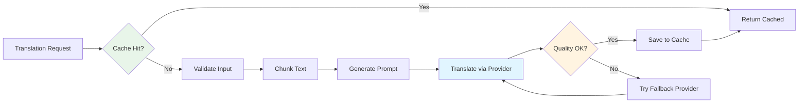

**Key Methods:**
```typescript
async translate(request: TranslationRequest): Promise<TranslationResult>
async translateBatch(chunks: TextChunk[]): Promise<TranslationResult[]>
```

#### 3.2 Text Extraction Service
**PDF text extraction with OCR fallback**

**Capabilities:**
- Native PDF text extraction (digital PDFs)
- OCR for scanned documents (Tesseract)
- Hybrid approach (auto-detection)
- Unicode normalization
- Artifact removal (headers, footers, page numbers)

#### 3.3 Text Chunking Service
**Intelligent text segmentation**

**Features:**
- Token-aware chunking (respects model limits)
- Tibetan sentence boundary detection (།, ༎)
- Context overlap between chunks
- Metadata preservation (page numbers, positions)

#### 3.4 Validation Service
**Input/output validation**

**Validators:**
- `TibetanContentValidator`: Minimum 50% Tibetan characters
- `UnicodeValidator`: Proper Unicode normalization
- `FormatValidator`: Output format compliance
- `PreservationValidator`: Tibetan text preserved

#### 3.5 Quality Scoring Service
**Comprehensive quality assessment**

**Metrics:**
```typescript
interface QualityScore {
  overall: number;        // Weighted average (0-1)
  confidence: number;     // Model confidence (0-1)
  format: number;         // Format compliance (0-1)
  preservation: number;   // Tibetan preservation (0-1)
}
```

---

### 4. Provider Layer
**Technology:** Plugin architecture with interface contracts

#### 4.1 Translation Providers

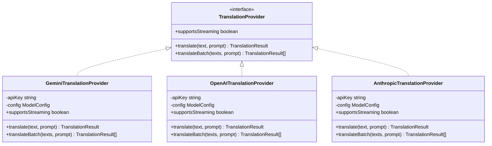

**Fallback Priority:**
1. Primary: Gemini 2.0 Flash (fastest, cheapest)
2. Fallback 1: OpenAI GPT-4 (highest quality)
3. Fallback 2: Anthropic Claude 3 (balanced)

#### 4.2 Embedding Providers

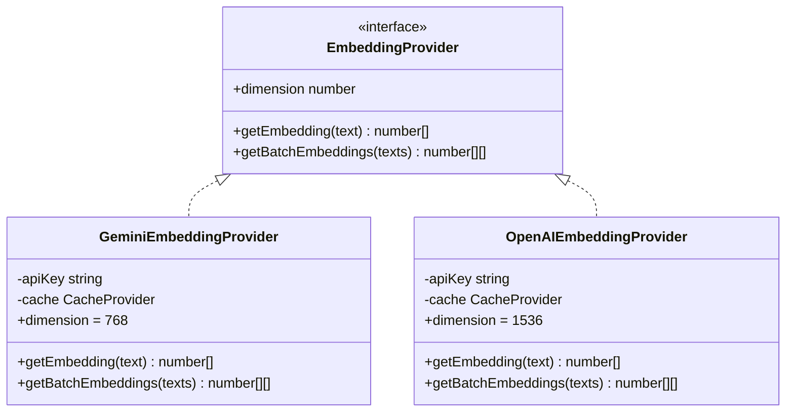

**Use Cases:**
- Example selection (cosine similarity)
- Translation memory (semantic search)
- Duplicate detection

---

### 5. Infrastructure Layer

#### 5.1 Multi-Layer Cache

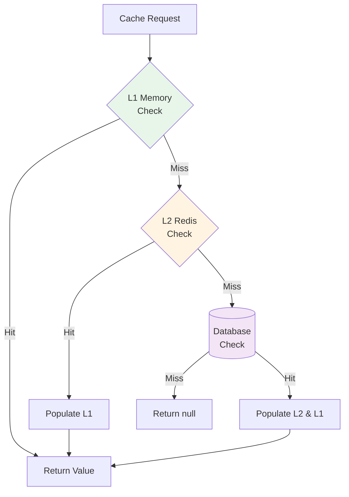

**Performance Characteristics:**

| Layer | Latency | Capacity | Persistence | Shared |
|-------|---------|----------|-------------|--------|
| **L1 (Memory)** | <1ms | 1,000 items | No | No |
| **L2 (Redis)** | 1-5ms | 100,000 items | Yes | Yes |
| **L3 (Database)** | 10-50ms | Unlimited | Yes | Yes |

**Cache Keys:**
```typescript
CacheKeys.translation(textHash)   // "trans:abc123..."
CacheKeys.embedding(textHash)     // "embed:abc123..."
CacheKeys.dictionary(tibetan)     // "dict:བོད་ཡིག"
```

**TTL Strategy:**
- Translations: 24 hours (L1), 7 days (L2), permanent (DB)
- Embeddings: 24 hours (L1), 30 days (L2)
- Dictionary: 7 days (L1/L2)

#### 5.2 Database Schema

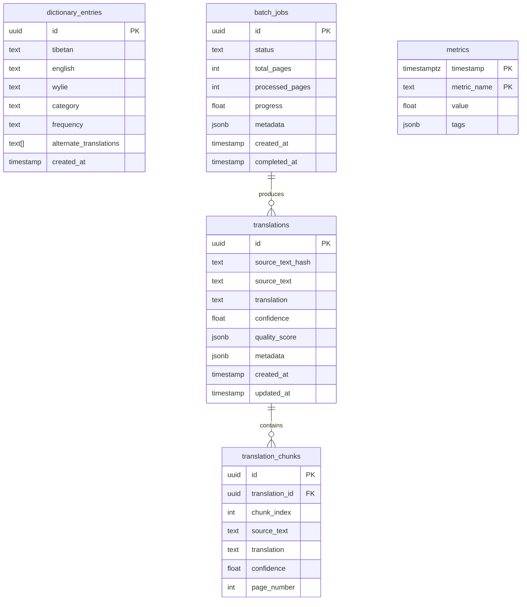

**Indexes:**
```sql
-- Fast translation lookup
CREATE INDEX idx_translation_hash ON translations(source_text_hash);

-- Recent translations
CREATE INDEX idx_translation_created ON translations(created_at DESC);

-- Dictionary lookups
CREATE INDEX idx_dictionary_tibetan ON dictionary_entries(tibetan);
CREATE INDEX idx_dictionary_category_freq ON dictionary_entries(category, frequency);

-- Metrics time-series queries
CREATE INDEX idx_metrics_time ON metrics(timestamp DESC, metric_name);
```

#### 5.3 Configuration Service

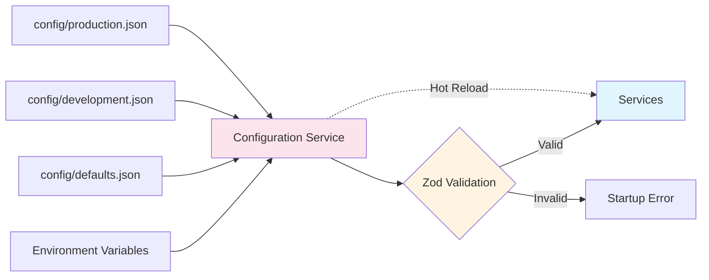

**Configuration Hierarchy:**
1. Defaults (`config/defaults.json`)
2. Environment-specific (`config/{env}.json`)
3. Environment variables (highest priority)

**Example:**
```typescript
const config = ConfigService.load(process.env);

// Validates on load
config.validate(); // Throws if invalid

// Type-safe access
const minConfidence = config.translation.quality.minConfidence;
```

---

## Data Flow

### Complete Translation Pipeline

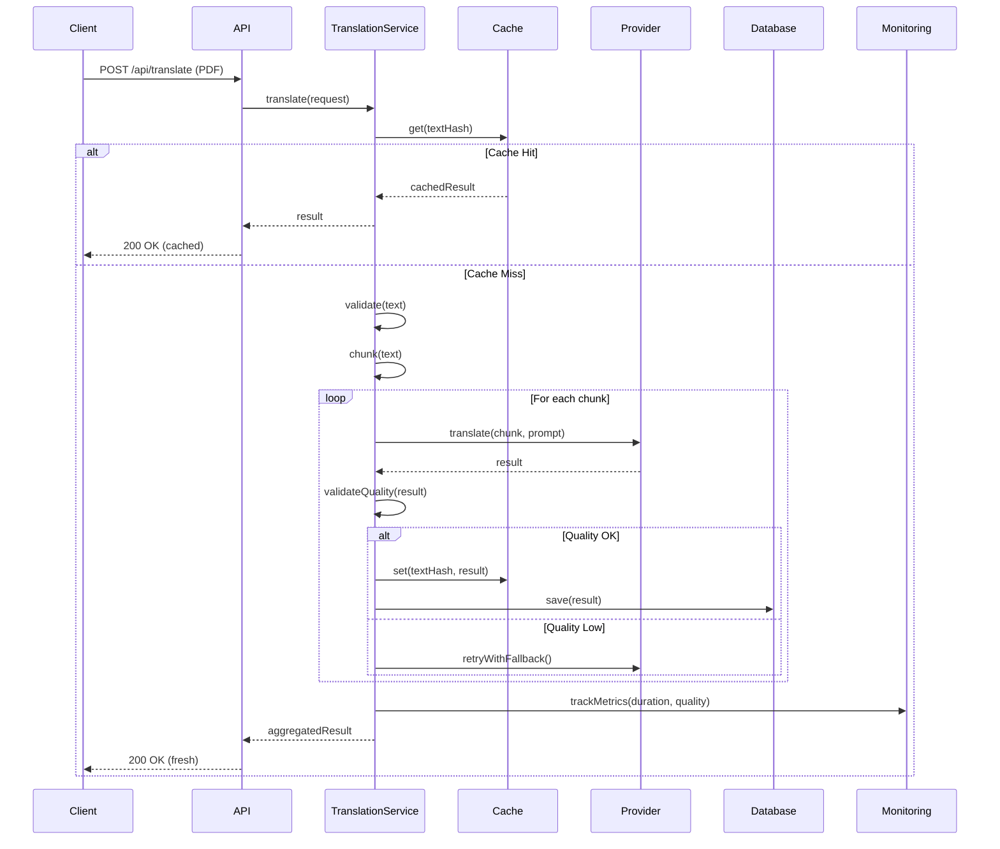

---

## Error Handling & Resilience

### Retry Strategy

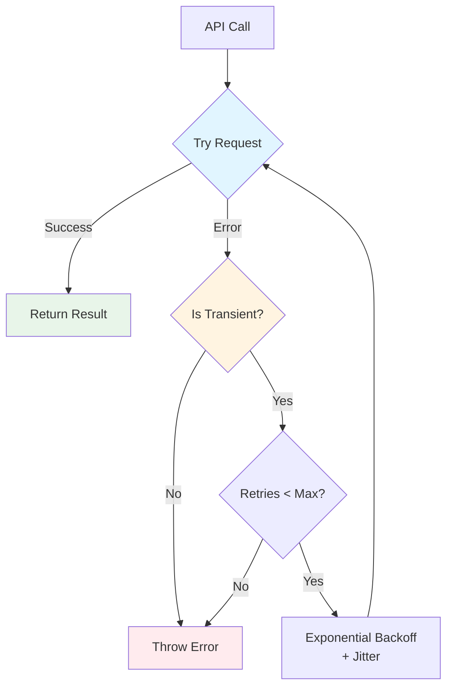

**Transient Errors (Retry):**
- `RATE_LIMIT`: Wait and retry with backoff
- `NETWORK_ERROR`: Retry up to 3 times
- `TIMEOUT`: Retry with longer timeout
- `API_UNAVAILABLE`: Retry with exponential backoff

**Non-Transient Errors (Fail Fast):**
- `VALIDATION_ERROR`: Invalid input, can't be fixed by retry
- `INSUFFICIENT_TIBETAN`: Input doesn't meet requirements
- `CONFIGURATION_ERROR`: System misconfiguration

### Fallback Providers

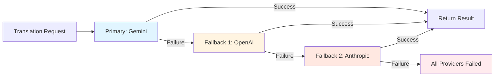

---

## Scalability & Performance

### Horizontal Scaling

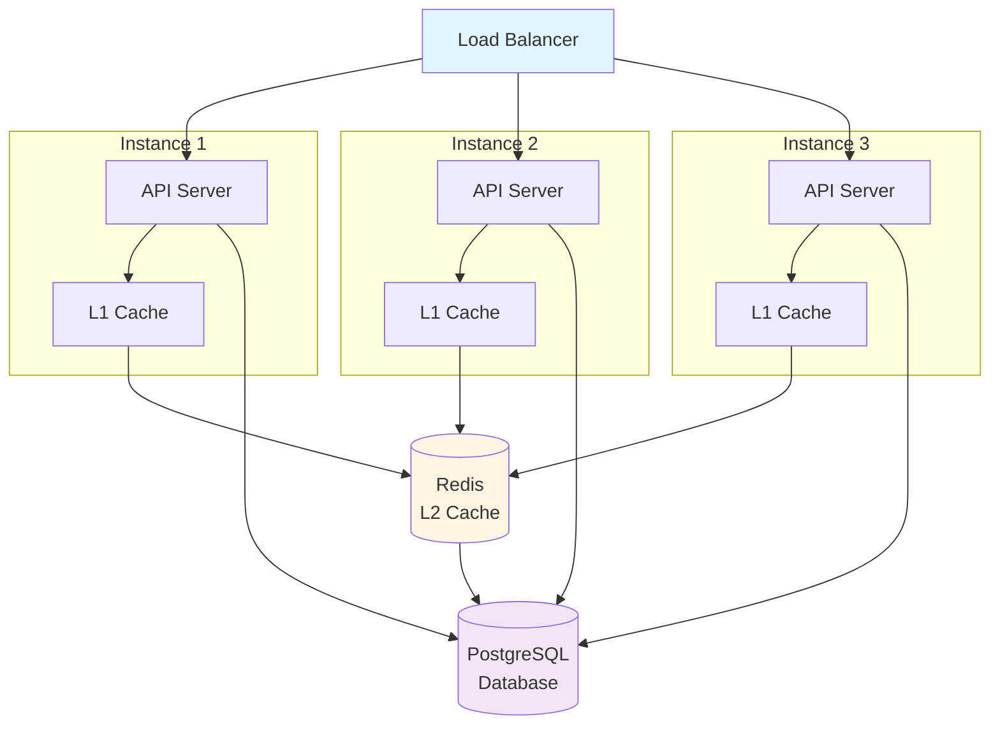

**Key Points:**
- Stateless API servers (can scale horizontally)
- Shared L2 cache (Redis) for cross-instance caching
- Database connection pooling
- Rate limiting per IP (not per instance)

### Performance Optimizations

| Optimization | Impact | Implementation |
|--------------|--------|----------------|
| **L1 Cache** | 99% cache hit latency <1ms | In-memory LRU cache |
| **L2 Cache** | 90% cache hit latency <5ms | Redis with 7-day TTL |
| **Parallel Translation** | 3x faster for multi-chunk documents | Process 5 chunks at once |
| **Batch Embeddings** | 5x faster than individual calls | Provider batching API |
| **Connection Pooling** | 10x faster DB queries | PostgreSQL pool (20 connections) |
| **Response Compression** | 80% smaller payloads | gzip middleware |

---

## Monitoring & Observability

### Metrics Collection

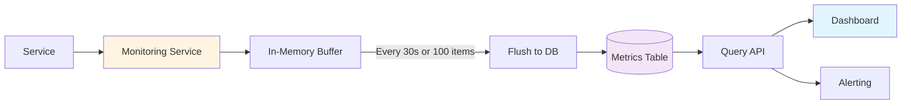

**Key Metrics:**

1. **Performance Metrics:**
   - `translation.duration`: Translation time (ms)
   - `api.request.duration`: API response time (ms)
   - `cache.hit_rate`: Cache hit percentage
   - `provider.latency`: Provider response time (ms)

2. **Quality Metrics:**
   - `quality.overall`: Average overall quality score
   - `quality.confidence`: Average confidence score
   - `quality.format`: Format compliance rate
   - `translation.success_rate`: Successful translations (%)

3. **Business Metrics:**
   - `translation.count`: Total translations processed
   - `translation.cost`: Estimated API cost ($)
   - `translation.cached`: Percentage from cache
   - `user.active`: Active users

### Health Checks

```
GET /api/monitoring/health

Response:
{
  "status": "healthy",
  "timestamp": 1699123456789,
  "services": {
    "database": "healthy",
    "cache": "healthy",
    "providers": {
      "gemini": "healthy",
      "openai": "degraded",  // ⚠️ Slow responses
      "anthropic": "down"    // ❌ Unavailable
    }
  },
  "metrics": {
    "uptime": 3600000,
    "requestsPerMinute": 120,
    "avgResponseTime": 450
  }
}
```

---

## Security Considerations

### Authentication & Authorization
- API key authentication for programmatic access
- Session-based auth for web UI
- Rate limiting per user/API key

### Data Protection
- API keys stored in environment variables (never in code)
- Database credentials in secure configuration
- HTTPS/TLS for all API communication

### Input Validation
- File size limits (max 100MB PDF)
- Content-type validation
- Unicode normalization to prevent injection

### Rate Limiting
```typescript
// 100 requests per 15-minute window
const limiter = rateLimit({
  windowMs: 15 * 60 * 1000,
  max: 100,
  message: 'Too many requests from this IP'
});
```

---

## Deployment Architecture

### Development
```
┌─────────────────────────────────┐
│  Developer Machine              │
│  ┌──────────┐  ┌──────────────┐ │
│  │  Client  │  │   Server     │ │
│  │  (Vite)  │  │  (Express)   │ │
│  │  :5173   │  │   :5439      │ │
│  └──────────┘  └──────────────┘ │
│        │              │          │
│  ┌──────────────────────┐       │
│  │  SQLite Database     │       │
│  │  (tibetan_trans.db)  │       │
│  └──────────────────────┘       │
└─────────────────────────────────┘
```

### Production
```
┌──────────────────────────────────────────┐
│  VPS (Hetzner CX22, $8/month)           │
│                                          │
│  ┌────────────────────────────────────┐  │
│  │  Nginx (Reverse Proxy + SSL)      │  │
│  │  Port 443 → :5439                 │  │
│  └────────────────────────────────────┘  │
│                ↓                         │
│  ┌────────────────────────────────────┐  │
│  │  Node.js App (Docker)              │  │
│  │  Client + Server Bundle            │  │
│  │  Port :5439                        │  │
│  └────────────────────────────────────┘  │
│                ↓                         │
│  ┌────────────────────────────────────┐  │
│  │  PostgreSQL (Docker)               │  │
│  │  Port :5432 (internal)             │  │
│  └────────────────────────────────────┘  │
│                                          │
│  Optional:                               │
│  ┌────────────────────────────────────┐  │
│  │  Redis (Docker)                    │  │
│  │  Port :6379 (internal)             │  │
│  └────────────────────────────────────┘  │
└──────────────────────────────────────────┘
```

---

## File Structure

```
/home/user/Translate/
├── client/                   # React frontend
│   └── src/
│       ├── components/       # UI components
│       ├── hooks/           # Custom React hooks
│       ├── lib/             # Client utilities
│       └── api/             # API client
├── server/                   # Express backend
│   ├── core/                # Core abstractions (NEW)
│   │   └── interfaces.ts    # Provider interfaces
│   ├── providers/           # Provider implementations (Phase 1)
│   │   ├── translation/
│   │   └── embeddings/
│   ├── services/            # Business logic
│   │   ├── translation/
│   │   ├── extraction/
│   │   ├── chunking/
│   │   ├── validation/
│   │   └── monitoring/
│   ├── routes/              # Express routes
│   ├── middleware/          # Express middleware
│   └── index.ts             # Server entry point
├── shared/                  # Shared code (NEW)
│   └── types.ts            # Shared types
├── db/                      # Database
│   ├── schema.ts           # Drizzle schema
│   └── migrations/         # Database migrations
├── tests/                   # Test suites
│   ├── unit/               # Unit tests
│   ├── integration/        # Integration tests
│   └── utils/              # Test utilities & mocks
├── docs/                    # Documentation (NEW)
│   └── architecture/       # Architecture docs
│       ├── ADR.md          # Architecture decisions
│       └── system-architecture.md  # This file
└── config/                  # Configuration (Phase 0.2)
    ├── defaults.json
    ├── development.json
    └── production.json
```

---

## Technology Stack

### Frontend
- **Framework:** React 18
- **Language:** TypeScript
- **Build Tool:** Vite
- **Routing:** Wouter
- **State Management:** TanStack Query (server state) + React hooks (local state)
- **UI Components:** shadcn/ui (Radix UI + Tailwind CSS)
- **Forms:** React Hook Form
- **Styling:** Tailwind CSS

### Backend
- **Runtime:** Node.js
- **Framework:** Express.js
- **Language:** TypeScript
- **ORM:** Drizzle ORM
- **Validation:** Zod
- **Testing:** Vitest

### Infrastructure
- **Database:** PostgreSQL (production) / SQLite (development)
- **Cache:** Redis (optional L2 cache)
- **File Processing:** pdf.js (extraction), Tesseract.js (OCR)
- **AI Providers:** Google Gemini, OpenAI, Anthropic

### DevOps
- **Containerization:** Docker
- **Reverse Proxy:** Nginx
- **SSL:** Let's Encrypt
- **CI/CD:** GitHub Actions
- **Hosting:** Hetzner VPS

---

## Next Steps

### Phase 0: Foundation (Current)
- [x] ~~Core interfaces~~ ✅
- [x] ~~Shared types~~ ✅
- [ ] Configuration service
- [ ] Database layer
- [ ] Caching infrastructure
- [ ] Test infrastructure

### Phase 1: Core Translation Engine
- [ ] Provider implementations
- [ ] Text processing pipeline
- [ ] Translation service
- [ ] Quality validation

### Phase 2-4: Advanced Features & Production
- [ ] Confidence system
- [ ] Monitoring & metrics
- [ ] Error recovery
- [ ] OCR support
- [ ] Job queue
- [ ] Security hardening
- [ ] Performance optimization
- [ ] Documentation
- [ ] Deployment

---

*This is a living document that will be updated as the architecture evolves.*
